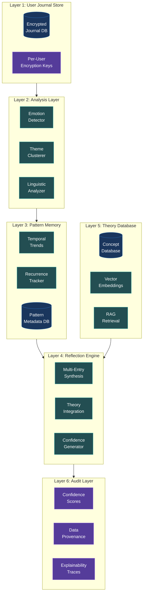
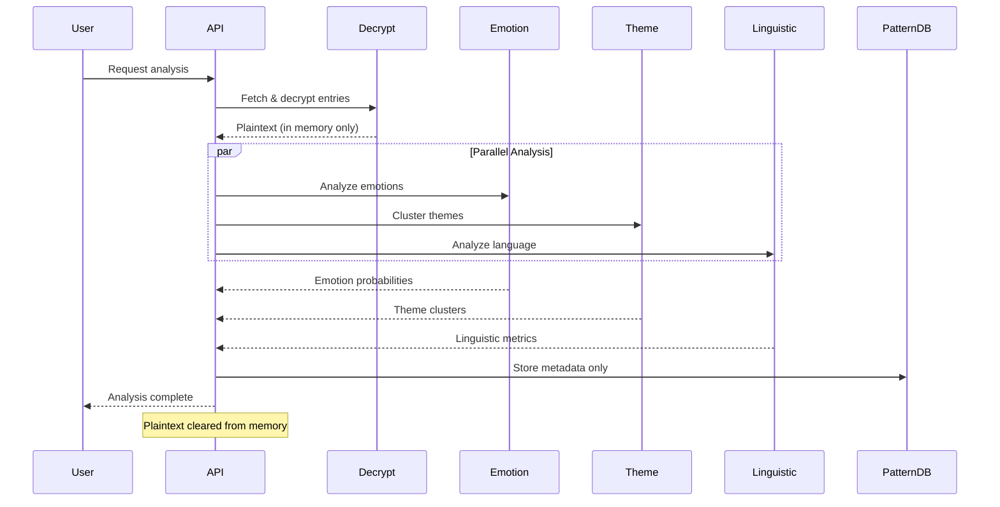
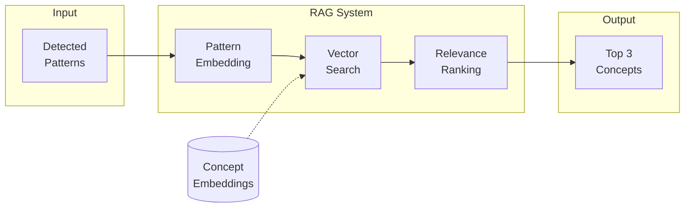
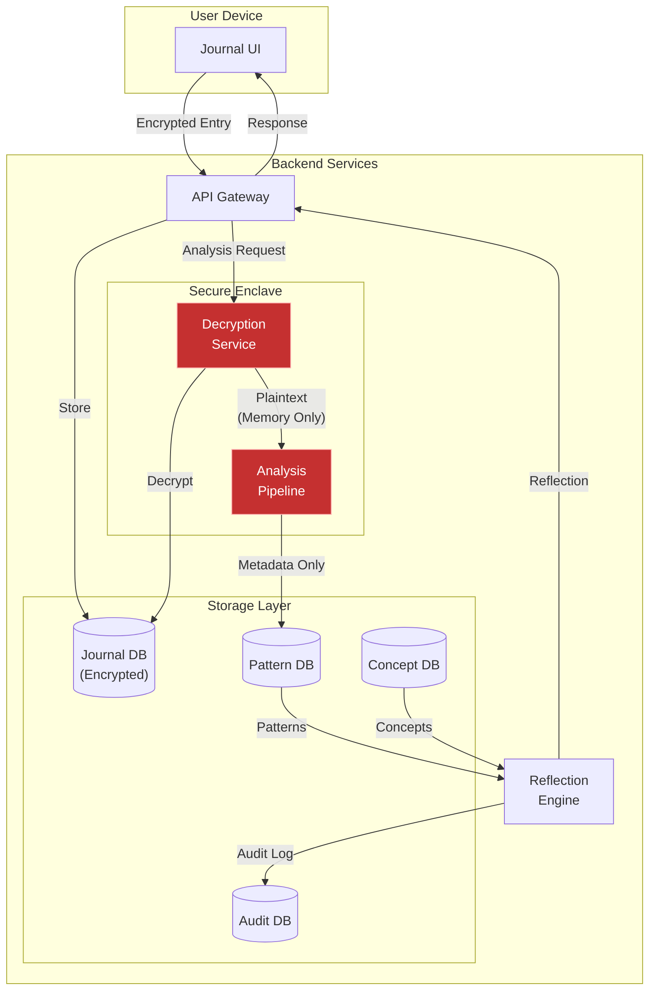
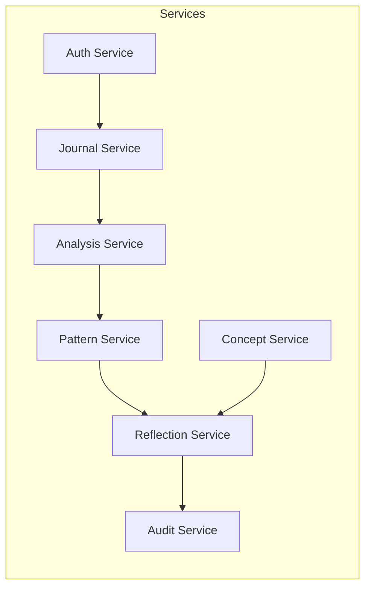
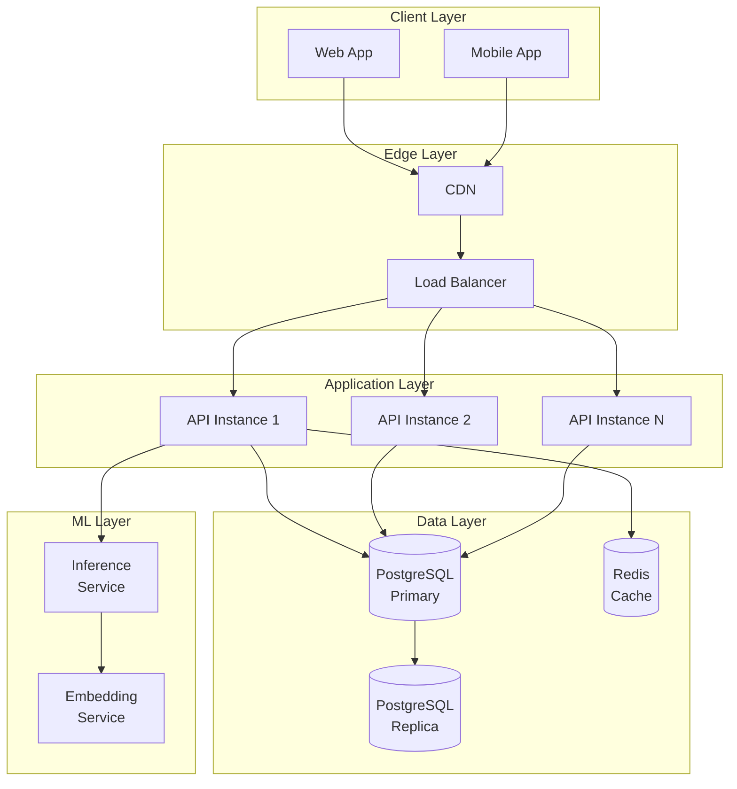

# Pensieve: System Architecture

> A reflective journaling system that analyzes user entries longitudinally to detect emotional, thematic, and linguistic patterns while prioritizing privacy, encryption, and user autonomy.

---

## Table of Contents

1. [System Overview](#system-overview)
2. [Architecture Layers](#architecture-layers)
3. [Data Flow](#data-flow)
4. [Component Specifications](#component-specifications)
5. [API Boundaries](#api-boundaries)
6. [Integration Points](#integration-points)

---

## System Overview

Pensieve operates as a **6-layer modular pipeline** with strict separation of concerns. Each layer has defined inputs, outputs, and responsibilities, enabling independent scaling, testing, and security auditing.

### Core Design Principles

| Principle | Implementation |
|-----------|----------------|
| **Clinical Boundaries** | No disorder labels, therapeutic claims, or medical authority |
| **Longitudinal Analysis** | Pattern detection across time, never single-entry judgments |
| **Source Grounding** | Every insight cites psychological/philosophical foundations |
| **Local Learning Only** | User data never trains global models |
| **Radical Transparency** | Every output is explainable and auditable |
| **Privacy by Design** | Zero-knowledge architecture with E2E encryption |

---

## Architecture Layers



---

## Layer Specifications

### Layer 1: User Journal Store (Encrypted)

**Purpose:** Secure, zero-knowledge storage for all journal entries.

| Component | Responsibility |
|-----------|----------------|
| **Journal Database** | Stores encrypted journal entries (AES-256-GCM) |
| **Key Management** | Per-user encryption keys derived from passwords |
| **Access Control** | User authentication required for decryption |

**Data Schema:**
```sql
entries (
    id UUID PRIMARY KEY,
    user_id UUID NOT NULL,
    encrypted_content BYTEA NOT NULL,
    iv BYTEA NOT NULL,          -- Initialization vector
    auth_tag BYTEA NOT NULL,    -- GCM authentication tag
    created_at TIMESTAMPTZ NOT NULL,
    updated_at TIMESTAMPTZ NOT NULL
)
```

**Security Guarantees:**
- Backend cannot decrypt without user authentication
- No plaintext stored in logs or backups
- Key derivation uses Argon2id with salt

---

### Layer 2: Analysis Layer (Inference Only)

**Purpose:** Extract emotional, thematic, and linguistic signals from decrypted entries.

| Component | Input | Output | Boundary |
|-----------|-------|--------|----------|
| **Emotion Detector** | Raw text | Probability distribution (joy: 0.6, sadness: 0.3, ...) | Does NOT claim ground truth emotions |
| **Theme Clusterer** | Entry embeddings | Topic clusters (relationships, work, growth) | Does NOT interpret meaning |
| **Linguistic Analyzer** | Text sequences | Metrics (pronoun usage, tense, complexity) | Does NOT diagnose from linguistics |

**Processing Flow:**


**Model Specifications:**
- Emotion: Fine-tuned DistilBERT on GoEmotions (27 labels)
- Theme: Sentence-BERT embeddings + HDBSCAN clustering
- Linguistic: Rule-based extractors + spaCy NLP

---

### Layer 3: Pattern Memory (Per-User Metadata)

**Purpose:** Track patterns over time without storing raw text.

| Component | Stored Data | NOT Stored |
|-----------|-------------|------------|
| **Temporal Trends** | Rolling averages, trend direction | Raw entry text |
| **Recurrence Tracker** | Theme frequency, emotion cycles | Full inference outputs |
| **Pattern Metadata** | Dates, counts, co-occurrences | Identifiable content |

**Data Schema:**
```sql
pattern_snapshots (
    id UUID PRIMARY KEY,
    user_id UUID NOT NULL,
    snapshot_date DATE NOT NULL,
    emotion_distribution JSONB,   -- {"joy": 0.4, "sadness": 0.2, ...}
    theme_frequencies JSONB,      -- {"work": 5, "relationships": 3}
    linguistic_metrics JSONB,     -- {"i_usage": 0.12, "certainty": 0.7}
    entry_count INTEGER,
    UNIQUE(user_id, snapshot_date)
)

trend_summaries (
    id UUID PRIMARY KEY,
    user_id UUID NOT NULL,
    trend_type TEXT,              -- 'emotion', 'theme', 'linguistic'
    trend_name TEXT,              -- 'joy_trend', 'work_theme', etc.
    direction TEXT,               -- 'increasing', 'decreasing', 'stable', 'cyclical'
    magnitude FLOAT,
    confidence FLOAT,
    window_start DATE,
    window_end DATE
)
```

**Learning Semantics:**
> "Pensieve learns *with* you, not *from* you. Your patterns stay yours—they never improve our system for others."

- ✅ Updates user-specific embeddings for better clustering
- ✅ Maintains rolling trend summaries
- ✅ Stores pattern metadata (dates, frequencies)
- ❌ Never trains global models on user data
- ❌ Never retains raw text after processing

---

### Layer 4: Reflection Engine

**Purpose:** Generate grounded, multi-entry reflections with theory integration.

**Generation Requirements:**

| Requirement | Implementation |
|-------------|----------------|
| Reference multiple entries | Minimum 3 entries across 7+ days |
| Probabilistic language | "may suggest," "resembles," "could indicate" |
| Cite sources | 1-3 concepts per reflection |
| Provide transparency | Expandable "Why this insight?" section |
| Avoid certainty | No definitive interpretations or commands |

**Reflection Structure:**
```json
{
  "reflection_id": "uuid",
  "content": "Over the past 3 weeks, your entries show increasing language related to control and certainty. This pattern resembles what researchers call 'intolerance of uncertainty'—a concept in cognitive psychology.",
  "metadata": {
    "entries_analyzed": ["entry_1", "entry_2", "..."],
    "date_range": "2025-01-01 to 2025-01-25",
    "concepts_referenced": [
      {
        "id": "concept_uuid",
        "name": "Intolerance of Uncertainty",
        "source": "Carleton et al. (2012)",
        "relevance_score": 0.78
      }
    ],
    "confidence": "moderate",
    "confidence_score": 0.65
  },
  "disclaimer": "This reflection is not medical advice. Pensieve does not diagnose or treat mental health conditions."
}
```

**Forbidden Outputs:**
- ❌ Direct advice ("You should try...")
- ❌ Commands ("Stop worrying about...")
- ❌ Interpretations as fact ("You are experiencing...")
- ❌ Diagnostic language ("This indicates depression...")

---

### Layer 5: Theory & Citation Database (RAG)

**Purpose:** Provide grounded psychological and philosophical concepts for reflections.

**Content Categories:**

| Category | Examples |
|----------|----------|
| **Psychological Frameworks** | CBT, positive psychology, attachment theory, emotion regulation |
| **Philosophical Ideas** | Stoicism, existentialism, Buddhist psychology |
| **Research Summaries** | Peer-reviewed findings, meta-analyses |

**Retrieval Flow:**


**Citation Formatting:**
- Academic: "Author et al. (Year)"
- Framework: "Framework Name (Origin)"
- Example: "Carleton et al. (2012)" or "Stoic Philosophy (Marcus Aurelius)"

---

### Layer 6: Audit & Transparency Layer

**Purpose:** Ensure every output is explainable and auditable.

| Component | Function |
|-----------|----------|
| **Confidence Scores** | Quantify certainty (capped at 80% max) |
| **Data Provenance** | Track which entries contributed to reflections |
| **Explainability Traces** | Log reasoning steps for each reflection |

**Audit Log Schema:**
```sql
reflection_audit (
    id UUID PRIMARY KEY,
    reflection_id UUID NOT NULL,
    user_id UUID NOT NULL,
    generated_at TIMESTAMPTZ NOT NULL,
    model_version TEXT NOT NULL,
    entry_ids UUID[],
    concepts_used UUID[],
    confidence_score FLOAT,
    generation_params JSONB,
    reasoning_trace JSONB
)
```

**User Export:**
Users can export their complete audit trail including:
- All reflections with metadata
- Pattern history
- Model versions used
- Concept citations

---

## Data Flow Summary



---

## API Boundaries

| Layer | Exposes | Consumes |
|-------|---------|----------|
| **Journal Store** | Encrypted entries, entry metadata | User credentials, encryption keys |
| **Analysis Layer** | Pattern metadata, analysis results | Decrypted entries (ephemeral) |
| **Pattern Memory** | Trend summaries, pattern snapshots | Analysis outputs |
| **Reflection Engine** | Reflection objects with metadata | Patterns, concepts |
| **Theory Database** | Concept matches, citations | Pattern embeddings |
| **Audit Layer** | Audit trails, exports | All reflection metadata |

---

## Integration Points

### External Dependencies

| Component | Dependency | Purpose |
|-----------|------------|---------|
| Emotion Detection | GoEmotions-trained model | Multi-label emotion classification |
| Embeddings | Sentence-BERT | Text vectorization |
| Clustering | HDBSCAN | Theme detection |
| NLP | spaCy | Linguistic feature extraction |
| Database | PostgreSQL + pgvector | Vector similarity search |

### Internal Service Communication



All inter-service communication uses:
- mTLS for transport security
- JWT tokens for service authentication
- Structured logging with correlation IDs

---

## Deployment Architecture



---

## Version History

| Version | Date | Changes |
|---------|------|---------|
| 1.0.0 | 2026-01-27 | Initial architecture specification |
