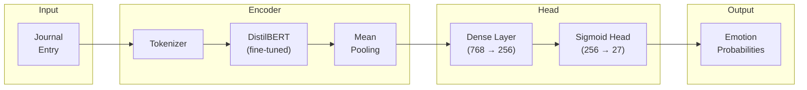
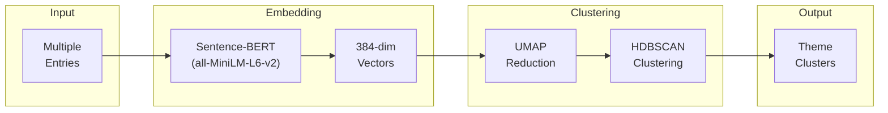
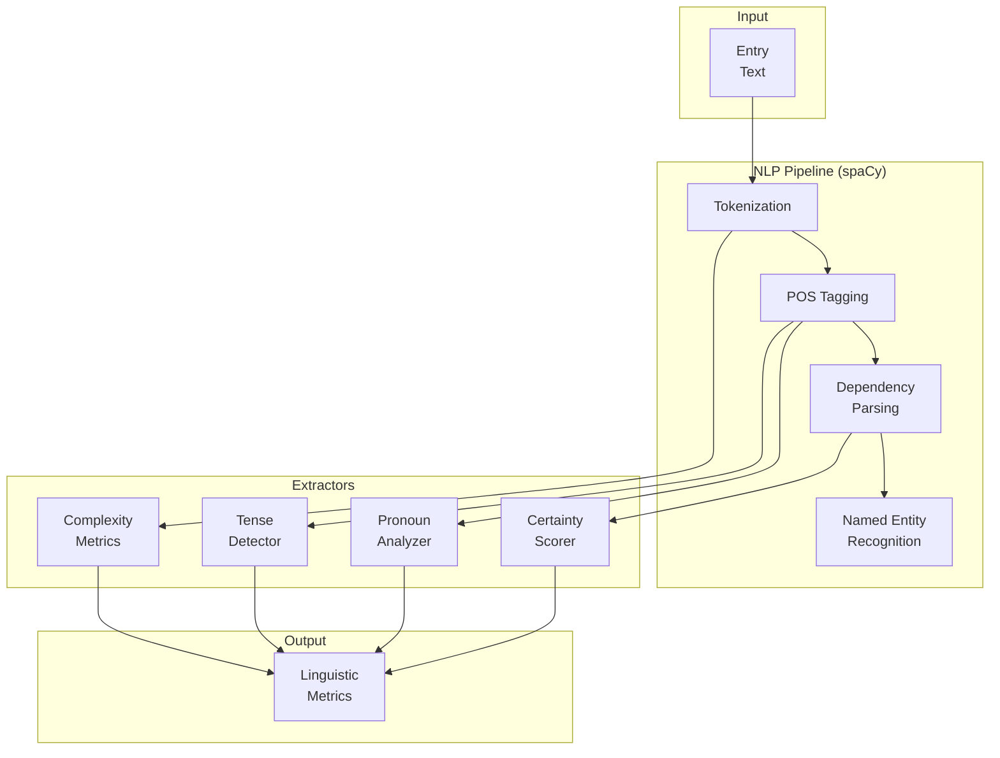
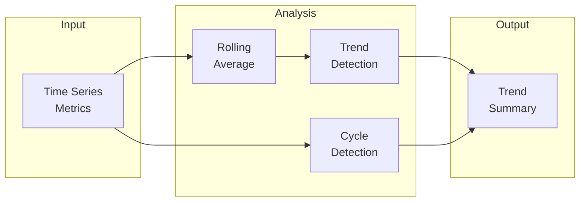

# Pensieve: Machine Learning Pipeline Specification

> ML components for emotion detection, theme clustering, linguistic analysis, and temporal pattern tracking—designed for inference only, with strict capability boundaries.

---

## Table of Contents

1. [Overview](#overview)
2. [Training Data Sources](#training-data-sources)
3. [Model Architectures](#model-architectures)
4. [Evaluation Frameworks](#evaluation-frameworks)
5. [Capability Boundaries](#capability-boundaries)
6. [Deployment Specifications](#deployment-specifications)

---

## Overview

The Pensieve ML pipeline consists of four inference-only components:

| Component | Purpose | Model Type |
|-----------|---------|------------|
| **Emotion Probability Detector** | Multi-label emotion classification | Fine-tuned Transformer |
| **Theme Clustering Module** | Recurring topic identification | Embedding + Clustering |
| **Linguistic Trend Analyzer** | Writing pattern extraction | Rule-based + Statistical |
| **Temporal Pattern Tracker** | Time-series trend detection | Statistical Analysis |

### Core Constraints

> [!CAUTION]
> **NEVER trained on user data.** All models use only public, ethically-sourced datasets.

- ✅ Inference on user text (ephemeral, in-memory)
- ✅ Per-user embedding updates for clustering
- ❌ Global model updates from user data
- ❌ Diagnostic or clinical classification
- ❌ Mental health condition prediction

---

## Training Data Sources

### Permitted Datasets

| Dataset | Use Case | Size | License |
|---------|----------|------|---------|
| **GoEmotions** (Google) | Multi-label emotion classification | 58K examples, 27 emotions | Apache 2.0 |
| **ISEAR** | Emotion antecedents and appraisals | 7.6K examples, 7 emotions | Academic |
| **Blog Authorship Corpus** | Linguistic style patterns | 681K posts | Academic |
| **20 Newsgroups** | Topic modeling baseline | 18K documents | Public Domain |
| **Reuters-21578** | Theme clustering evaluation | 21K documents | Public Domain |

### Prohibited Data Sources

| Source | Reason |
|--------|--------|
| User journal entries | Privacy violation |
| Clinical therapy transcripts | Ethical boundary |
| Social media with mental health labels | Diagnostic misuse risk |
| Any user-specific pattern data | Local learning only |

---

## Model Architectures

### A. Emotion Probability Detector

**Purpose:** Detect probability distributions over emotions from text, without claiming ground truth.

#### Architecture



#### Specifications

| Parameter | Value |
|-----------|-------|
| Base Model | DistilBERT-base-uncased |
| Fine-tuning Dataset | GoEmotions |
| Output Labels | 27 emotions (multi-label) |
| Activation | Sigmoid (independent probabilities) |
| Max Sequence Length | 512 tokens |
| Inference Latency | < 50ms (GPU), < 200ms (CPU) |

#### Emotion Labels

```python
EMOTION_LABELS = [
    "admiration", "amusement", "anger", "annoyance", "approval",
    "caring", "confusion", "curiosity", "desire", "disappointment",
    "disapproval", "disgust", "embarrassment", "excitement", "fear",
    "gratitude", "grief", "joy", "love", "nervousness",
    "optimism", "pride", "realization", "relief", "remorse",
    "sadness", "surprise"
]
```

#### Output Format

```json
{
  "entry_id": "uuid",
  "emotions": {
    "joy": 0.72,
    "gratitude": 0.65,
    "optimism": 0.58,
    "love": 0.34,
    "excitement": 0.28
  },
  "top_emotions": ["joy", "gratitude", "optimism"],
  "confidence": 0.68,
  "model_version": "emotion-v2.3.1"
}
```

#### Training Procedure

1. **Data Preparation**
   - Load GoEmotions dataset
   - Apply text preprocessing (lowercase, remove URLs, normalize whitespace)
   - Split: 80% train, 10% validation, 10% test

2. **Fine-tuning**
   ```python
   training_args = {
       "learning_rate": 2e-5,
       "batch_size": 32,
       "epochs": 4,
       "weight_decay": 0.01,
       "warmup_ratio": 0.1,
       "loss": "binary_cross_entropy_with_logits"
   }
   ```

3. **Threshold Calibration**
   - Use validation set to find optimal thresholds per emotion
   - Target precision ≥ 0.7 for each emotion

---

### B. Theme Clustering Module

**Purpose:** Identify recurring topics across journal entries over time.

#### Architecture



#### Specifications

| Parameter | Value |
|-----------|-------|
| Embedding Model | all-MiniLM-L6-v2 |
| Embedding Dimension | 384 |
| UMAP Components | 10 |
| HDBSCAN min_cluster_size | 3 |
| HDBSCAN min_samples | 2 |
| Minimum Entries for Clustering | 10 |

#### Theme Labeling

Themes are labeled using extractive keywords, not generative text:

```python
def label_cluster(entries_in_cluster):
    # Extract TF-IDF keywords from cluster
    vectorizer = TfidfVectorizer(max_features=10, stop_words='english')
    tfidf = vectorizer.fit_transform(entries_in_cluster)
    keywords = vectorizer.get_feature_names_out()
    
    # Return top 3 keywords as label
    return keywords[:3]
```

#### Output Format

```json
{
  "user_id": "uuid",
  "clustering_date": "2025-01-25",
  "themes": [
    {
      "cluster_id": 0,
      "label": ["work", "meeting", "deadline"],
      "entry_count": 12,
      "percentage": 0.35,
      "representative_dates": ["2025-01-10", "2025-01-15", "2025-01-20"]
    },
    {
      "cluster_id": 1,
      "label": ["family", "dinner", "weekend"],
      "entry_count": 8,
      "percentage": 0.24,
      "representative_dates": ["2025-01-12", "2025-01-19"]
    }
  ],
  "unclustered_entries": 5,
  "model_version": "theme-v1.2.0"
}
```

#### Per-User Learning

The clustering module supports **per-user embedding updates**:

1. Store user's entry embeddings in their pattern database
2. Incrementally add new entries to embedding space
3. Re-cluster periodically (weekly) to detect theme evolution
4. Embeddings never leave user's encrypted storage

---

### C. Linguistic Trend Analyzer

**Purpose:** Track writing patterns over time without inferring mental state.

#### Architecture



#### Metrics Extracted

| Metric | Description | Calculation |
|--------|-------------|-------------|
| **I-Usage** | First-person singular frequency | Count("I", "me", "my") / total_words |
| **We-Usage** | First-person plural frequency | Count("we", "us", "our") / total_words |
| **Tense Distribution** | Past/present/future ratios | POS-based verb tense detection |
| **Certainty Score** | Confidence in assertions | Presence of hedging words (might, maybe, perhaps) |
| **Complexity** | Sentence structure complexity | Flesch-Kincaid Grade Level |
| **Emotional Intensity** | Strength of emotional language | VADER sentiment magnitude |

#### Certainty Scoring

```python
HEDGING_WORDS = [
    "might", "maybe", "perhaps", "possibly", "probably",
    "could", "would", "should", "seem", "appear",
    "guess", "think", "believe", "feel", "suppose"
]

CERTAINTY_WORDS = [
    "definitely", "certainly", "absolutely", "always", "never",
    "must", "will", "know", "sure", "certain"
]

def calculate_certainty(text):
    words = text.lower().split()
    hedging = sum(1 for w in words if w in HEDGING_WORDS)
    certain = sum(1 for w in words if w in CERTAINTY_WORDS)
    total = hedging + certain
    
    if total == 0:
        return 0.5  # Neutral
    
    return certain / total
```

#### Output Format

```json
{
  "entry_id": "uuid",
  "metrics": {
    "i_usage": 0.12,
    "we_usage": 0.02,
    "tense": {
      "past": 0.45,
      "present": 0.40,
      "future": 0.15
    },
    "certainty_score": 0.35,
    "complexity_grade": 8.2,
    "emotional_intensity": 0.67,
    "word_count": 342,
    "sentence_count": 18
  },
  "model_version": "linguistic-v1.1.0"
}
```

---

### D. Temporal Pattern Tracker

**Purpose:** Detect trends in patterns over time without predicting future states.

#### Architecture



#### Trend Detection

```python
from scipy import stats
import numpy as np

def detect_trend(values, dates):
    """
    Detect trend direction using linear regression.
    Returns: 'increasing', 'decreasing', 'stable', or 'cyclical'
    """
    if len(values) < 7:
        return "insufficient_data", 0.0, 0.0
    
    # Convert dates to numeric
    x = np.arange(len(values))
    
    # Linear regression
    slope, intercept, r_value, p_value, std_err = stats.linregress(x, values)
    
    # Check for cyclical pattern
    if is_cyclical(values):
        return "cyclical", slope, r_value ** 2
    
    # Significance threshold
    if p_value > 0.05:
        return "stable", slope, r_value ** 2
    
    if slope > 0.01:
        return "increasing", slope, r_value ** 2
    elif slope < -0.01:
        return "decreasing", slope, r_value ** 2
    else:
        return "stable", slope, r_value ** 2

def is_cyclical(values, min_periods=2):
    """Detect cyclical patterns using autocorrelation."""
    if len(values) < 14:
        return False
    
    # Calculate autocorrelation at weekly lag
    autocorr = np.correlate(values - np.mean(values), values - np.mean(values), mode='full')
    autocorr = autocorr[len(autocorr)//2:]
    autocorr = autocorr / autocorr[0]
    
    # Check for significant weekly pattern
    weekly_lag = 7
    if len(autocorr) > weekly_lag and autocorr[weekly_lag] > 0.5:
        return True
    
    return False
```

#### Output Format

```json
{
  "user_id": "uuid",
  "analysis_date": "2025-01-25",
  "window": {
    "start": "2025-01-01",
    "end": "2025-01-25"
  },
  "trends": [
    {
      "metric": "joy",
      "type": "emotion",
      "direction": "increasing",
      "magnitude": 0.15,
      "confidence": 0.72,
      "r_squared": 0.68
    },
    {
      "metric": "certainty_score",
      "type": "linguistic",
      "direction": "decreasing",
      "magnitude": -0.08,
      "confidence": 0.65,
      "r_squared": 0.54
    },
    {
      "metric": "work_theme",
      "type": "theme",
      "direction": "cyclical",
      "period_days": 7,
      "confidence": 0.78
    }
  ],
  "model_version": "temporal-v1.0.0"
}
```

---

## Evaluation Frameworks

### Emotion Detector Metrics

| Metric | Target | Description |
|--------|--------|-------------|
| **Macro F1** | ≥ 0.55 | Average F1 across all emotions |
| **Weighted F1** | ≥ 0.65 | F1 weighted by class frequency |
| **Precision@3** | ≥ 0.70 | Precision of top-3 predicted emotions |
| **Calibration Error** | ≤ 0.10 | Expected Calibration Error |

### Theme Clustering Metrics

| Metric | Target | Description |
|--------|--------|-------------|
| **Silhouette Score** | ≥ 0.30 | Cluster separation quality |
| **Noise Ratio** | ≤ 0.25 | Fraction of unclustered entries |
| **Cluster Stability** | ≥ 0.70 | Consistency across re-clustering |

### Linguistic Analyzer Metrics

| Metric | Target | Description |
|--------|--------|-------------|
| **POS Accuracy** | ≥ 0.95 | Part-of-speech tagging accuracy |
| **Tense Detection Accuracy** | ≥ 0.90 | Verb tense classification |
| **Inter-rater Agreement** | ≥ 0.80 | Cohen's κ with human annotations |

### Temporal Tracker Metrics

| Metric | Target | Description |
|--------|--------|-------------|
| **Trend Detection Accuracy** | ≥ 0.75 | Correct trend direction on synthetic data |
| **False Positive Rate** | ≤ 0.15 | Spurious trend detection rate |
| **Cycle Detection F1** | ≥ 0.65 | Cyclical pattern identification |

---

## Capability Boundaries

### What Each Component DOES

| Component | Capability |
|-----------|-----------|
| **Emotion Detector** | Output probability distributions over emotions |
| **Theme Clusterer** | Group similar entries into topic clusters |
| **Linguistic Analyzer** | Extract quantitative writing metrics |
| **Temporal Tracker** | Identify trends in metrics over time |

### What Each Component Does NOT Do

| Component | Prohibited Capability |
|-----------|----------------------|
| **Emotion Detector** | ❌ Claim ground-truth emotions, ❌ Diagnose mood disorders |
| **Theme Clusterer** | ❌ Interpret meaning, ❌ Assign clinical significance |
| **Linguistic Analyzer** | ❌ Infer mental state from linguistics |
| **Temporal Tracker** | ❌ Predict future states, ❌ Label patterns as pathological |

### Confidence Constraints

```python
MAX_CONFIDENCE = 0.80  # Hard cap

def constrain_confidence(raw_confidence):
    """Apply confidence ceiling and add uncertainty."""
    # Cap at maximum
    capped = min(raw_confidence, MAX_CONFIDENCE)
    
    # Add epistemic uncertainty for edge cases
    if raw_confidence > 0.90:
        # Very high raw confidence suggests potential overfit
        capped *= 0.95
    
    return round(capped, 2)
```

---

## Deployment Specifications

### Model Serving

| Component | Serving Framework | Hardware | Batch Size |
|-----------|------------------|----------|------------|
| Emotion Detector | ONNX Runtime | CPU/GPU | 1-8 |
| Theme Clusterer | scikit-learn | CPU | N/A |
| Linguistic Analyzer | spaCy | CPU | 1-4 |
| Temporal Tracker | NumPy/SciPy | CPU | N/A |

### Model Versioning

```
{component}-v{major}.{minor}.{patch}

Examples:
- emotion-v2.3.1
- theme-v1.2.0
- linguistic-v1.1.0
- temporal-v1.0.0
```

### Update Policy

| Update Type | Frequency | Approval Required |
|-------------|-----------|-------------------|
| Patch (bug fixes) | As needed | Engineering review |
| Minor (improvements) | Quarterly | Product + Engineering |
| Major (architecture) | Annually | Full stakeholder review |

### Monitoring

```yaml
metrics:
  - name: inference_latency_p95
    threshold: 200ms
    action: alert
  
  - name: emotion_confidence_mean
    threshold: 0.5
    action: monitor
  
  - name: clustering_noise_ratio
    threshold: 0.30
    action: alert
  
  - name: model_errors_per_hour
    threshold: 10
    action: page
```

---

## Version History

| Version | Date | Changes |
|---------|------|---------|
| 1.0.0 | 2026-01-27 | Initial ML pipeline specification |
